# ASIC Design Class

This is Varad Bharadiya (IMT2021532). Course - Physical Design of ASICs (VLS508)

# Task 1: Compiling the C Code with GCC and RISCV
<details>


This part demonstrates how to compile and run a simple C program that calculates the sum of numbers from 1 to N using GCC
### Steps:

1. **Navigate to Home Directory**
   - Open the terminal and use this command to navigate to the home directory:
   ```bash
   cd
   ```
   - Then open the Leafpad editor for writing the C code.
   
   

2. **Create a .c File**
   - Create a C file that calculates the sum of numbers from 1 to N.

   

3. **Compile and Run the Program**
   - Compile the program using the GCC compiler:
   ```bash
   gcc sum1ton.c
   ./a.out
   ```

   

## Compile Using RISC-V Compiler
This part demonstrates how to compile and run a simple C program that calculates the sum of numbers from 1 to N using RISCV architecture.
### Steps:

1. **Check the Code**
   - Verify the code using the `cat` command:
   ```bash
   cat sum1ton.c
   ```

   

2. **Compile the Code with RISC-V GCC**
   - Compile the code using the RISC-V GCC compiler:
   ```bash
   riscv64-unknown-elf-gcc -O1 -o sum1ton.o sum1ton.c
   ```

3. **Generate Assembly Code**
   - Get the assembly code of the C program:
   ```bash
   riscv64-unknown-elf-objdump -d sum1ton.o
   ```
   - For easier viewing, you can add `| less` to the command:
   ```bash
   riscv64-unknown-elf-objdump -d sum1ton.o | less
   ```

   

4. **Calculate Number of Instructions**
   - We'll obtain the output once more, and this time we'll focus directly on the main section. To determine the number of instructions, we'll subtract the address of the first instruction of the current section from that of the next section, then divide the result by 4 (since the increment is 4 for each step). This method allows us to conclude that there are 15 sets of instructions when using O1.

   

   - To verify, we can do it using a calculator:
   
   

5. **Compile with Optimization Flag `Ofast`**
   - Recompile the code using the `Ofast` optimization flag:
   ```bash
   riscv64-unknown-elf-gcc -Ofast -o sum1ton_ofast.o sum1ton.c
   ```

   

6. **Compare Number of Instructions**
   - Re-run the command to get the number of instructions, and you'll see that fewer instructions are needed to execute the program with `Ofast` optimization.
   
   
---
</details>

# Task 2: Debug Mode in Spike on RISC-V
<details>
This part demonstrates how to use the debug mode in RISCV.(using SPIKE)


### Steps:

1. **Run the Program in Debug Mode**
   - After compiling the code with the RISC-V compiler, run the code using Spike in debug mode:
   ```bash
   spike -d pk sum1ton.o
   ```
   - Then it enters the debug mode. One can run the instructions till a specific address as shown in the example:
   ```bash
   until pc 0 100b0
   ```
   
   

2. **Set Breakpoints and Track Registers**
   - Track the values in the register (e.g., register `a2`):
   ```bash
   reg 0 a2
   ```
   - Now press Enter to run the next instruction (`lui a2, 0x1`). Check the content of the `a2` register again, and you'll see that it has been updated.
   
   

3. **Step Through Instructions**
   - Step through instructions and check the content of the `sp` (stack pointer) register:
   ```bash
   addi sp, sp, -16
   until pc 0 100b8
   reg 0 sp
   ```
   - After running the next instruction, you'll see that the `sp` value is reduced by 16 (10 in HEX).

   
   
   - To verify:

   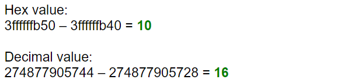
---
</details>


# Task-3:RISC-V Instruction Formats
<details>

In the RISC-V architecture, instruction formats serve as a 'contract' between assembly language and hardware. When an assembly language command is executed, the hardware must understand precisely what to do. These instructions are encoded in a series of 0s and 1s, representing different operations, data locations, and more.

RISC-V defines six instruction formats, each with its own structure and purpose:

### Core Instruction Formats

1. **R-Type (Register-Register Operations)**
    - **Purpose:** Used for arithmetic and logical operations that involve two source registers and a destination register.
    - **Format:**
    \`\`\`
    opcode[6:0] | rd[11:7] | funct3[14:12] | rs1[19:15] | rs2[24:20] | funct7[31:25]
    \`\`\`
    - **Fields:**
      - **opcode:** Operation code (7 bits)
      - **rd:** Destination register (5 bits)
      - **funct3:** Function code to differentiate operations (3 bits)
      - **rs1:** First source register (5 bits)
      - **rs2:** Second source register (5 bits)
      - **funct7:** Additional function code (7 bits)
    - **Example Instructions:** ADD, SUB, AND, OR, XOR, SLT

2. **I-Type (Immediate Operations)**
    - **Purpose:** Used for operations involving an immediate value and one or two registers, as well as load instructions.
    - **Format:**
    \`\`\`
    opcode[6:0] | rd[11:7] | funct3[14:12] | rs1[19:15] | imm[31:20]
    \`\`\`
    - **Fields:**
      - **opcode:** Operation code (7 bits)
      - **rd:** Destination register (5 bits)
      - **funct3:** Function code (3 bits)
      - **rs1:** Source register (5 bits)
      - **imm:** Immediate value (12 bits)
    - **Example Instructions:** ADDI, LW, JALR

3. **S-Type (Store Operations)**
    - **Purpose:** Used for store instructions where data from a register is stored into memory.
    - **Format:**
    \`\`\`
    opcode[6:0] | imm[11:7] | funct3[14:12] | rs1[19:15] | rs2[24:20] | imm[31:25]
    \`\`\`
    - **Fields:**
      - **opcode:** Operation code (7 bits)
      - **imm[11:7]:** Immediate value (lower 5 bits) (5 bits)
      - **funct3:** Function code (3 bits)
      - **rs1:** Base address register (5 bits)
      - **rs2:** Source register (5 bits)
      - **imm[31:25]:** Immediate value (upper 7 bits) (7 bits)
    - **Example Instructions:** SW, SB

4. **U-Type (Upper Immediate Operations)**
    - **Purpose:** Used for instructions that operate with a 20-bit upper immediate, typically for addressing purposes.
    - **Format:**
    \`\`\`
    opcode[6:0] | rd[11:7] | imm[31:12]
    \`\`\`
    - **Fields:**
      - **opcode:** Operation code (7 bits)
      - **rd:** Destination register (5 bits)
      - **imm:** Upper immediate value (20 bits)
    - **Example Instructions:** LUI, AUIPC

5. **B-Type (Branch Operations)**
    - **Purpose:** Used for conditional branch instructions, which alter the program flow based on comparisons between registers.
    - **Format:**
    \`\`\`
    opcode[6:0] | imm[11] | imm[4:1] | funct3[14:12] | rs1[19:15] | rs2[24:20] | imm[10:5] | imm[12]
    \`\`\`
    - **Fields:**
      - **opcode:** Operation code (7 bits)
      - **imm[11:7]:** Immediate value bits 4:1 (4 bits)
      - **funct3:** Function code (3 bits)
      - **rs1:** First source register (5 bits)
      - **rs2:** Second source register (5 bits)
      - **imm[12]:** Immediate value bit 11 (1 bit)
    - **Example Instructions:** BEQ, BNE, BLT, BGE

6. **J-Type (Jump Operations)**
    - **Purpose:** Used for jump instructions, which direct program control to a new address, optionally storing the return address in a register.
    - **Format:**
    \`\`\`
    opcode[6:0] | rd[11:7] | imm[19:12] | imm[11] | imm[10:1] | imm[20]
    \`\`\`
    - **Fields:**
      - **opcode:** Operation code (7 bits)
      - **rd:** Destination register (5 bits)
      - **imm:** Immediate value (20 bits)
    - **Example Instructions:** JAL


## 32-bit Instruction Encodings

Below are the 32-bit instruction encodings for the given assembly instructions:

1. **ADD r5, r6, r7** (R-Type)
   - **Opcode**: `0110011`
   - **funct3**: `000`
   - **funct7**: `0000000`
   - **rs1**: `00110` (r6)
   - **rs2**: `00111` (r7)
   - **rd**: `00101` (r5)
   - **Instruction**: `0000000 00111 00110 000 00101 0110011`
   - **Hex**: `0x007302B3`

2. **SUB r7, r5, r6** (R-Type)
   - **Opcode**: `0110011`
   - **funct3**: `000`
   - **funct7**: `0100000`
   - **rs1**: `00101` (r5)
   - **rs2**: `00110` (r6)
   - **rd**: `00111` (r7)
   - **Instruction**: `0100000 00110 00101 000 00111 0110011`
   - **Hex**: `0x406283B3`

3. **AND r6, r5, r7** (R-Type)
   - **Opcode**: `0110011`
   - **funct3**: `111`
   - **funct7**: `0000000`
   - **rs1**: `00101` (r5)
   - **rs2**: `00111` (r7)
   - **rd**: `00110` (r6)
   - **Instruction**: `0000000 00111 00101 111 00110 0110011`
   - **Hex**: `0x0072F333`

4. **OR r8, r6, r5** (R-Type)
   - **Opcode**: `0110011`
   - **funct3**: `110`
   - **funct7**: `0000000`
   - **rs1**: `00110` (r6)
   - **rs2**: `00101` (r5)
   - **rd**: `01000` (r8)
   - **Instruction**: `0000000 00101 00110 110 01000 0110011`
   - **Hex**: `0x00536433`

5. **XOR r8, r5, r4** (R-Type)
   - **Opcode**: `0110011`
   - **funct3**: `100`
   - **funct7**: `0000000`
   - **rs1**: `00101` (r5)
   - **rs2**: `00100` (r4)
   - **rd**: `01000` (r8)
   - **Instruction**: `0000000 00100 00101 100 01000 0110011`
   - **Hex**: `0x0042C433`

6. **SLT r10, r2, r4** (R-Type)
   - **Opcode**: `0110011`
   - **funct3**: `010`
   - **funct7**: `0000000`
   - **rs1**: `00010` (r2)
   - **rs2**: `00100` (r4)
   - **rd**: `01010` (r10)
   - **Instruction**: `0000000 00100 00010 010 01010 0110011`
   - **Hex**: `0x00412533`

7. **ADDI r12, r3, 5** (I-Type)
   - **Opcode**: `0010011`
   - **funct3**: `000`
   - **imm**: `0000000000000101` (5)
   - **rs1**: `00011` (r3)
   - **rd**: `01100` (r12)
   - **Instruction**: `000000000101 00011 000 01100 0010011`
   - **Hex**: `0x00518613`

8. **SW r3, r1, 4** (S-Type)
   - **Opcode**: `0100011`
   - **funct3**: `010`
   - **imm[4:0]**: `00100` (lower 5 bits of 4)
   - **imm[11:5]**: `0000000` (upper 7 bits of 4)
   - **rs1**: `00001` (r1)
   - **rs2**: `00011` (r3)
   - **Instruction**: `0000000 00011 00001 010 00100 0100011`
   - **Hex**: `0x0030A223`

9. **SRL r16, r11, r2** (R-Type)
   - **Opcode**: `0110011`
   - **funct3**: `101`
   - **funct7**: `0000000`
   - **rs1**: `01011` (r11)
   - **rs2**: `00010` (r2)
   - **rd**: `10000` (r16)
   - **Instruction**: `0000000 00010 01011 101 10000 0110011`
   - **Hex**: `0x0025D833`

10. **BNE r0, r1, 20** (B-Type)
    - **Opcode**: `1100011`
    - **funct3**: `001`
    - **imm[4:0]**: `10100` (lower 5 bits of 20)
    - **imm[11:5]**: `000000` (upper 7 bits of 20)
    - **rs1**: `00001` (r1)
    - **rs2**: `00000` (r0)
    - **Instruction**: `0000000 00000 00001 001 10100 1100011`
    - **Hex**: `0x00009A63`

11. **BEQ r0, r0, 15** (B-Type)
    - **Opcode**: `1100011`
    - **funct3**: `000`
    - **imm[4:0]**: `01111` (lower 5 bits of 15)
    - **imm[11:5]**: `000000` (upper 7 bits of 15)
    - **rs1**: `00000` (r0)
    - **rs2**: `00000` (r0)
    - **Instruction**: `0000000 00000 00000 000 01111 1100011`
    - **Hex** : `0x000007E3`
   
12. **LW r13, r11, 2** (I-Type)
    - **opcode**: `0000011` (7 bits)
    - **rd** (r13): `01101` (5 bits)
    - **funct3**: `010` (3 bits)
    - **rs1** (r11): `01011` (5 bits)
    - **imm**: `000000000010` (12 bits)
    - **Instruction**: `000000000010 01011 010 01101 0000011`
    - **Hex**: `0x0025A683`

 13. **SLL r15, r11, r2** (R-Type)
 - **opcode**: `0110011` (7 bits)
 - **rd** (r15): `01111` (5 bits)
 - **funct3**: `001` (3 bits)
 - **rs1** (r11): `01011` (5 bits)
 - **rs2** (r2): `00010` (5 bits)
 - **funct7**: `0000000` (7 bits)
 - **Instruction**: `0000000 00010 01011 001 01111 0110011`
 - **Hex**: `0x002597B3`


Below are the 32-bit instruction encodings for the given assembly instructions:

| Instruction       | Type | 32-bit Instruction                            | Hexadecimal  |
|-------------------|------|-----------------------------------------------|--------------|
| ADD r5, r6, r7    | R    | 0000000 00111 00110 000 00101 0110011         | 0x007302B3   |
| SUB r7, r5, r6    | R    | 0100000 00110 00101 000 00111 0110011         | 0x406283B3   |
| AND r6, r5, r7    | R    | 0000000 00111 00101 111 00110 0110011         | 0x0072F333   |
| OR r8, r6, r5     | R    | 0000000 00101 00110 110 01000 0110011         | 0x00536433   |
| XOR r8, r5, r4    | R    | 0000000 00100 00101 100 01000 0110011         | 0x0042C433   |
| SLT r10, r2, r4   | R    | 0000000 00100 00010 010 01010 0110011         | 0x00412533   |
| ADDI r12, r3, 5   | I    | 000000000101 00011 000 01100 0010011          | 0x00518613   |
| SW r3, r1, 4      | S    | 0000000 00011 00001 010 00100 0100011         | 0x0030A223   |
| SRL r16, r11, r2  | R    | 0000000 00010 01011 101 10000 0110011         | 0x0025D833   |
| BNE r0, r1, 20    | B    | 0000000 00000 00001 001 10100 1100011         | 0x00009A63   |
| BEQ r0, r0, 15    | B    | 0000000 00000 00000 000 01111 1100011         | 0x000007E3   |
| LW r13, r11, 2    | I    | 000000000010 01011 010 01101 0000011          | 0x0025A683   |
| SLL r15, r11, r2  | R    | 0000000 00010 01011 001 01111 0110011         | 0x002597B3   |


---

This document provides an overview of the different instruction formats in the RISC-V architecture, explaining how each format is structured and used in various operations.
</details>

# Task-4: AIM : To execute assembly instructions using a given verilog code for a riscV processor and compare the waveform with Hardcoded instructions.
<details>
   There is some variations in the ISA followed by RISCV and the hardcoded ISA for the below given instrucions. The differences are shown in the table below :
      # RISC-V ISA vs. Hardcoded ISA

| Operation         | Standard RISC-V ISA (Hexadecimal) | Hardcoded ISA (Hexadecimal) |
|-------------------|-----------------------------------|-----------------------------|
| ADD r5, r6, r7    | 0x007302B3                        | 0x02208300                  |
| SUB r7, r5, r6    | 0x406283B3                        | 0x02209380                  |
| AND r6, r5, r7    | 0x0072F333                        | 0x0230A400                  |
| OR r8, r6, r5     | 0x00536433                        | 0x02513480                  |
| XOR r8, r5, r4    | 0x0042C433                        | 0x0240C500                  |
| SLT r10, r2, r4   | 0x00412533                        | 0x02415580                  |
| ADDI r12, r3, 5   | 0x00518613                        | 0x00520600                  |
| SW r3, r1, 4      | 0x0030A223                        | 0x00209181                  |
| SRL r16, r11, r2  | 0x0025D833                        | 0x00271803                  |
| BNE r0, r1, 20    | 0x00009A63                        | 0x00f00002                  |
| BEQ r0, r0, 15    | 0x000007E3                        | 0x00210700                  |
| LW r13, r11, 2    | 0x0025A683                        | 0x00208681                  |
| SLL r15, r11, r2  | 0x002597B3                        | 0x00208783                  |

We will be using gtkwave to analyse the waveforms
   

First we start with analysis of our instructions provided for the activity in RISC-V
1.| ADD r5, r6, r7    | 0x007302B3                     

   
   
2.| SUB r7, r5, r6    | 0x406283B3                      

   
   
3. | AND r6, r5, r7    | 0x0072F333                     
   

4. | OR r8, r6, r5     | 0x00536433                      
   
   
   
5. | XOR r8, r5, r4    | 0x0042C433                      

   

6. | SLT r10, r2, r4   | 0x00412533          

   

7. | ADDI r12, r3, 5   | 0x00518613                       

   

8. | SW r3, r1, 4      | 0x0030A223               

   

9. | SRL r16, r11, r2  | 0x0025D833                     

   

10. | BNE r0, r1, 20    | 0x00009A63                       

   

We now analyse the gtkwaves for hardcoded ISA

   

   

   

   

   

   

   

   

   


A difference in waveforms can be observed for both set of instructions
</details>

# Task-5: Compiling C application using GCC and RISC-V
<details>

## Application Name- Fibonacci Sequence Generator.

``` bash
#include <stdio.h>

// Function to print Fibonacci sequence
int main() {
    int terms;

    // Ask the user for the number of terms
    printf("Enter the number of terms in the Fibonacci sequence: ");
    scanf("%d", &terms);
	
    long long int first = 0, second = 1, next;

    // Check if the number of terms is valid
    if (terms <= 0) {
        printf("Number of terms must be a positive integer.\n");
        return 0;
    }

    // Print the Fibonacci sequence
    printf("Fibonacci Sequence:\n");
    for (int i = 0; i < terms; i++) {
        if (i == 0) {
            printf("%lld ", first);
            continue;
        }
        if (i == 1) {
            printf("%lld ", second);
            continue;
        }
        next = first + second;
        first = second;
        second = next;
        printf("%lld ", next);
    }
    printf("\n");

    return 0;
}

```
Compiling the Application using GCC compiler:

   

Compiling using RISC-V Compiler:

   

**Conclusion**:We have infered that the output is same in both the cases.

Also adding the screenshots of creating dumpfile

   

   


</details>

# Task-6: To design a Baisc Risc-V processor core using TL-Verilog on Makerchip, MYTH Day 3_5 activities
<details>
The variour parts of the code are shown below :

   

The generated visual is as shown below:

   

Here is the log image:

   

The signals include the named clock clock: "clk_var":

   

The code segments are shown below:

   

   

   

   

   

   

   

   

   

   

   

   

   

   

   

We now have screen shots for xreg14 where we store the value at each steps.

   

   

   

   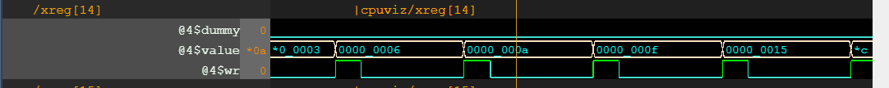

   


</details>


# Task-7: RISC-V Pre-Synthesis Simulation: A Comparative Study using Icarus Verilog (Iverilog), GTKWave, and Makerchip
<details>
	
## Overview

This project involves designing a RISC-V processor using TL-Verilog in the Makerchip IDE and converting it to Verilog using the Sandpiper-SaaS compiler for implementation on an FPGA. Pre-synthesis simulations are then performed using the GTKWave simulator. This README outlines the step-by-step process for running these simulations and compares the output waveforms.


## Conversion and Simulation Steps

1. **Translate TL-Verilog to Verilog:**

   Use the Sandpiper-SaaS compiler to convert the `.tlv` definition of RISC-V into a `.v` Verilog file:

   ```bash
   sandpiper-saas -i ./src/module/*.tlv -o rvmyth.v --bestsv --noline -p verilog --outdir ./src/module/
   ```

2. **Create the `pre_synth_sim.vcd` File:**

   Generate the pre-synthesis simulation file:

   ```bash
   make pre_synth_sim
   ```

3. **Compile and Simulate the RISC-V Design:**

   Compile and simulate the RISC-V design using Iverilog:

   ```bash
   iverilog -o output/pre_synth_sim.out -DPRE_SYNTH_SIM src/module/testbench.v -I src/include -I src/module -
   ```

4. **Run the Simulation:**

   Change the working directory to `output` and execute the simulation:

   ```bash
   cd output
   ./pre_synth_sim.out
   ```

5. **View the Simulation Output in GTKWave:**

   Open the `.vcd` simulation file through the GTKWave simulation tool:

   ```bash
   gtkwave pre_synth_sim.vcd
   ```
Here is the gtkwave:

   


## Comparison of Output Waveforms

After running the above steps, you can compare the output waveforms obtained from GTKWave with those from the Makerchip IDE. The comparison will help validate the accuracy and performance of the RISC-V design.

From the MakerChip:

   
   
   
   
   
   
   
   
   

From the GtkWave:

   


## Conclusion

This project demonstrates the process of designing, converting, and simulating a RISC-V processor using TL-Verilog, Verilog, Iverilog, and GTKWave. The comparison of output waveforms across different tools ensures the correctness of the design before FPGA implementation.
</details>

# Task-8 Few Installations and BabySoc Simulation
<details>
	In this task we had to install verilog, gtkwave, yosys and opensta and BabySoc Simulation. OpenSTA was installed using the GitHub link given.
	
The screenshots for the others are given below:
	
   

   

Running the BabySoc on the RiscV_CPU.v file (sum of numbers):
   
   

Waveforms:
   
   


</details>

# Task -9 RTL design using Verilog with SKY130 Technology
<details>

 ## Initial Set-up

<details>

### The following Commands were to be executed for initial setup:

```bash
sudo -i
sudo apt-get install git
ls
cd /home/Varad
mkdir VLSI
cd VLSI
git clone https://github.com/kunalg123/sky130RTLDesignAndSynthesisWorkshop.git
cd sky130RTLDesignAndSynthesisWorkshop/verilog_files
ls
```
We have the image for the same:
	
 We also can see the files in verilog_files directory:
 	
</details>

## Day-1

<details>
Introduction to iverilog and GTKWave: 
This tutorial involved learning about how to simulate the design and testbench for a 2x1 multiplexer, using iverilog, and displaying the waveform on GTKWave

   
   

   
   

Introduction to Yosys: 
This tutorial involved the use of Yosys for synthesising the design we created in Verilog, viewing its netlists and the cells that are generated for the purpose of creating the circuit. The following commands are used:

Open Yosys and read the standard cell library file and then run the `read_verilog` command to run the good_mux.v file:

   

Next we run the `synth -top` command to synthesise the design to yosys based standard cells:

   

   We can see some info at the end after synthesis.

   

   Now, we run `abc` command to use the sky130 standard cells with optimised design.

   

   run `show` command to see the schematic and how the design maps it to the standard cells of sky130 tech.

   

   Now, we get the netlist using the `write_verilog` command

   

   

   With -noattr flag. To make netlist more readable:
   
   

   


	
</details>

  ## Day-2
  
<details>
	
Yosys Synthesis for Multiple Modules: This tutorial involved the synthesis of a design file that has more than one module.

We follow similar steps again for the multiple_modules.v file

We get the following design for the schematic:

   

   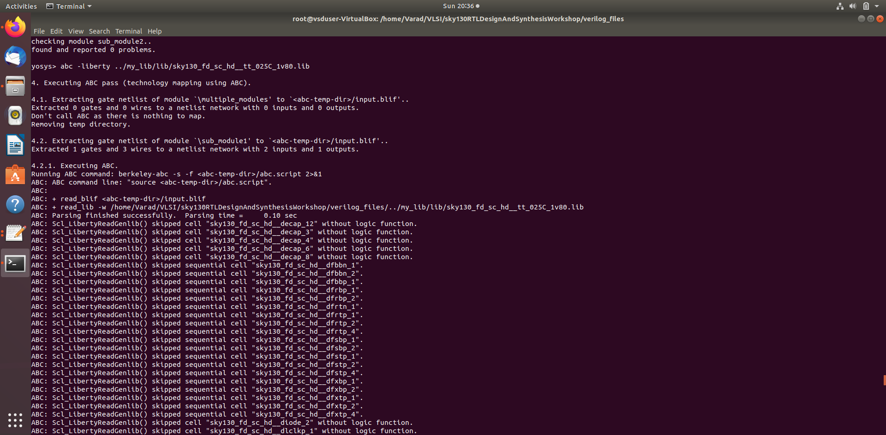

   

   

   

   With flatten netlist:

   

   schematic for the same when flatten

   


Use of Module Level Synthesis: This method is preferred when multiple instances of same module are used. The synthesis is carried out once and is replicate multiple times, and the multiple instances of the same module are stitched together in the top module. This method is helpful when making use of divide and conquer algorithm 

```bash
1. yosys
2. read_liberty -lib ../my_lib/lib/sky130_fd_sc_hd__tt_025C_1v80.lib
3. read_verilog multiple_modules.v
4. synth -top sub_module1
5. abc -liberty ../my_lib/lib/sky130_fd_sc_hd__tt_025C_1v80.lib
6. show
```

Simulation of D-Flipflop using Iverilog and GTKWave: Performed simulations for 3 types of D-Flipflops - Asynchronous Reset, Asynchronous Set and Synchronous Reset. 

1. Asynchronous Reset

This figure shows asynchronous reset.
   

This figure shows that the dff is posedge.

   

2. Asynchronous Set

This figure shows asynchronus set

   

This figure shows that dff is posedge.

   

3. Synchronous Reset.

The figure below shows the part when synchronous reset is into action.

   

This figure shows that dff is posedge.

   

A screenshot demonstrating that all the above 3 files were run on my system.

   

Now we shall perform synthesis.

Asynchronous Reset:

   

   

   

   

   

   

Asynchronus Set:

   

   

   

Synchronus Set:
   

   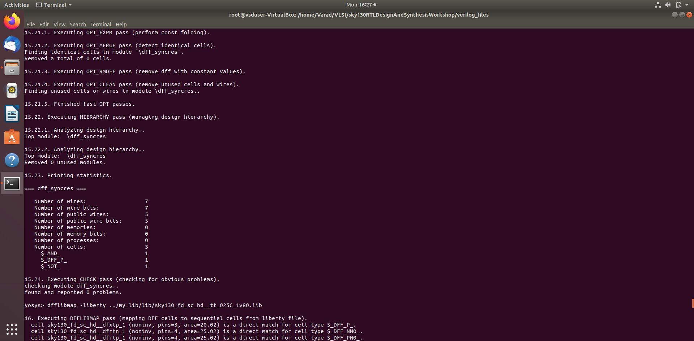

   

   

Multiplication by 2: This tutorial, we get to know that specific multiplier hardware is not required for multiplication of a number by 2. It can simply be achieved by concatenating the number itself with a zero in the LSB.

```bash
1. yosys
2. read_liberty -lib ../my_lib/lib/sky130_fd_sc_hd__tt_025C_1v80.lib
3. read_verilog mult_2.v
4. synth -top mul2
5. abc -liberty ../my_lib/lib/sky130_fd_sc_hd__tt_025C_1v80.lib
6. show
7. write_verilog -noattr mul2_net.v
8. gvim mul2_net.v
```

   

   


Multiplication by 9: This tutorial, we get to know that specific multiplier hardware is not required for multiplication of a number by 9. It can simply be achieved by concatenating the number with itself

```bash
1. yosys
2. read_liberty -lib ../lib/sky130_fd_sc_hd__tt_025C_1v80.lib
3. read_verilog mult_9.v
4. synth -top mult9
5. abc -liberty ../my_lib/lib/sky130_fd_sc_hd__tt_025C_1v80.lib
6. show
7. write_verilog -noattr mul9_net.v
8. gvim mul9_net.v
```
   

   

   

   

</details>

## Day-3
<details>
	
Optimization of Various Designs
Design infers 2 input AND Gate:

```bash
1. yosys
2. read_liberty -lib ../my_lib/lib/sky130_fd_sc_hd__tt_025C_1v80.lib
3. read_verilog opt_check.v
4. synth -top opt_check
5. abc -liberty ../my_lib/lib/sky130_fd_sc_hd__tt_025C_1v80.lib
6. opt_clean -purge
7. show
```
6.Removes unused or redundant logic in the design and purges any dangling wires or gates.

   

   

   

Design infers 2 input OR Gate: 

```bash
1. yosys
2. read_liberty -lib ../my_lib/lib/sky130_fd_sc_hd__tt_025C_1v80.lib
3. read_verilog opt_check2.v
4. synth -top opt_check2
5. abc -liberty ../my_lib/lib/sky130_fd_sc_hd__tt_025C_1v80.lib
6. opt_clean -purge
7. show
```
   

   

   

Design infers 3 input AND Gate: 

```bash
1. yosys
2. read_liberty -lib ../my_lib/lib/sky130_fd_sc_hd__tt_025C_1v80.lib
3. read_verilog opt_check3.v
4. synth -top opt_check3
5. abc -liberty ../my_lib/lib/sky130_fd_sc_hd__tt_025C_1v80.lib
6. opt_clean -purge
7. show
```
   

   

   

Design infers 2 input XNOR Gate (3 input Boolean Logic) :
```bash
1. yosys
2. read_liberty -lib ../my_lib/lib/sky130_fd_sc_hd__tt_025C_1v80.lib
3. read_verilog opt_check4.v
4. synth -top opt_check4
5. abc -liberty ../my_lib/lib/sky130_fd_sc_hd__tt_025C_1v80.lib
6. opt_clean -purge
7. show
```

   

   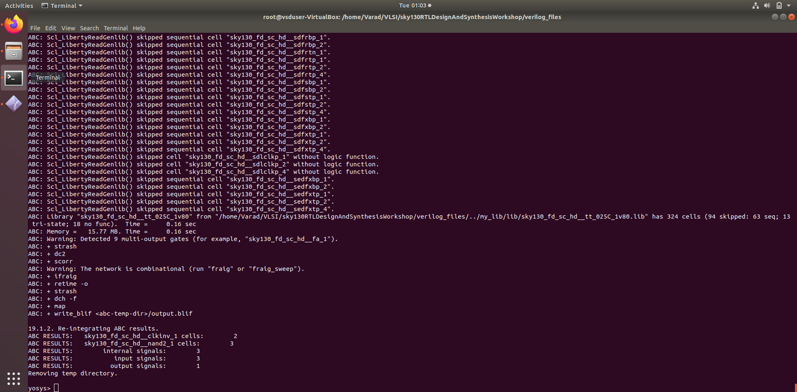

   

Multiple Module Optimization-1 :
```bash

1. yosys
2. read_liberty -lib ../my_lib/lib/sky130_fd_sc_hd__tt_025C_1v80.lib
3. read_verilog multiple_module_opt.v
4. synth -top multiple_module_opt
5. abc -liberty ../my_lib/lib/sky130_fd_sc_hd__tt_025C_1v80.lib
6. opt_clean -purge
7. show
```

   

   

   

Multiple Module Optimization-2:
```bash

1. yosys
2. read_liberty -lib ../my_lib/lib/sky130_fd_sc_hd__tt_025C_1v80.lib
3. read_verilog multiple_module_opt2.v
4. synth -top multiple_module_opt2
5. abc -liberty ../my_lib/lib/sky130_fd_sc_hd__tt_025C_1v80.lib
6. opt_clean -purge
7. show
```

D-Flipflop Constant 1 with Asynchronous Reset (active low) :
```bash
iverilog dff_const1.v tb_dff_const1.v
./a.out
gtkwave tb_dff_const1.vcd
```

   


From the waveform, it can be observed that the Q output is always high when reset is zero, and reset doesn't depend on clock edge.
```bash
1. yosys
2. read_liberty -lib ../my_lib/lib/sky130_fd_sc_hd__tt_025C_1v80.lib
3. read_verilog dff_const1.v
4. synth -top dff_const1
5. dfflibmap -liberty ../my_lib/lib/sky130_fd_sc_hd__tt_025C_1v80.lib
7. show
```
   

   

D-Flipflop Constant 2 with Asynchronous Reset (active high) :

```bash
iverilog dff_const2.v tb_dff_const2.v
./a.out
gtkwave tb_dff_const2.vcd
```
   

From the waveform, it can be observed that the Q output is always high irrespective of reset.
```bash
1. yosys
2. read_liberty -lib ../my_lib/lib/sky130_fd_sc_hd__tt_025C_1v80.lib
3. read_verilog dff_const2.v
4. synth -top dff_const2
5. dfflibmap -liberty ../my_lib/lib/sky130_fd_sc_hd__tt_025C_1v80.lib
7. show
```
   

   


D-Flipflop Constant 3 with Asynchronous Reset (active low)

```bash
1. yosys
2. read_liberty -lib ../my_lib/lib/sky130_fd_sc_hd__tt_025C_1v80.lib
3. read_verilog dff_const3.v
4. synth -top dff_const3
5. dfflibmap -liberty ../my_lib/lib/sky130_fd_sc_hd__tt_025C_1v80.lib
7. show
```
   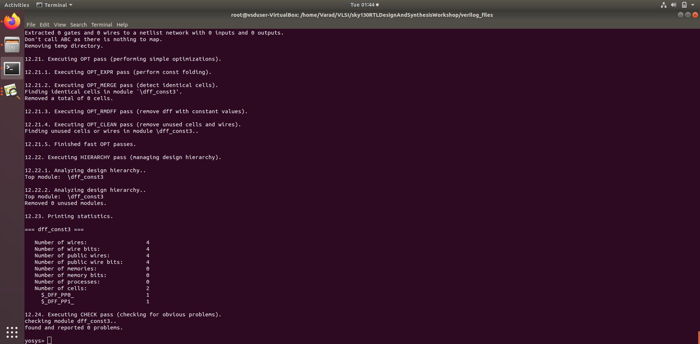

   
   
This module defines a D flip-flop, for a positive edge of reset, q is set to 1 and q1 is set to 0. On each clock cycle, q1 is set to 1, and q is updated with the value of q1.

When synthesized, the design will result in a flip-flop where q becomes 1 after the first clock cycle post-reset and stays 1 afterward.

D-Flipflop Constant 4 with Asynchronous Reset (active high) :
```bash
1. yosys
2. read_liberty -lib ../my_lib/lib/sky130_fd_sc_hd__tt_025C_1v80.lib
3. read_verilog dff_const4.v
4. synth -top dff_const4
5. dfflibmap -liberty ../my_lib/lib/sky130_fd_sc_hd__tt_025C_1v80.lib
7. show
```

   

   

This module defines a D flip-flop that sets both q and q1 to 1 on a positive edge of reset. On each clock cycle, q1 remains 1, and q is updated with the value of q1 (which is always 1).

When synthesized, the design will result in a flip-flop where q is always 1, regardless of the reset or clock state.


D-Flipflop Constant 5 with Asynchronous Reset :
```bash
1. yosys
2. read_liberty -lib ../my_lib/lib/sky130_fd_sc_hd__tt_025C_1v80.lib
3. read_verilog dff_const5.v
4. synth -top dff_const5
5. dfflibmap -liberty ../my_lib/lib/sky130_fd_sc_hd__tt_025C_1v80.lib
7. show
```
   

   

This module defines a D flip-flop that resets both q and q1 to 0 on a positive edge of reset. On each clock cycle, it sets q1 to 1 and then updates q with the value of q1 (which will always be 1 after the first cycle).

When synthesized, the design will result in a flip-flop where q is always 1 after the first clock cycle post-reset.

Counter Optimization 1: 
```bash
1. yosys
2. read_liberty -lib ../my_lib/lib/sky130_fd_sc_hd__tt_025C_1v80.lib
3. read_verilog counter_opt.v
4. synth -top counter_opt
5. dfflibmap -liberty ../my_lib/lib/sky130_fd_sc_hd__tt_025C_1v80.lib
7. show
```
   

   
   
Counter Optimization 2:
```bash
1. yosys
2. read_liberty -lib ../my_lib/lib/sky130_fd_sc_hd__tt_025C_1v80.lib
3. read_verilog counter_opt2.v
4. synth -top counter_opt2
5. dfflibmap -liberty ../my_lib/lib/sky130_fd_sc_hd__tt_025C_1v80.lib
7. show
```

   

   

</details>


## Day-4
<details>

```bash
iverilog ternary_operator_mux.v tb_ternary_operator_mux.v
./a.out
gtkwave tb_ternary_operator_mux.vcd
```


   

   

```bash
1. yosys
2. read_liberty -lib ../my_lib/lib/sky130_fd_sc_hd__tt_025C_1v80.lib
3. read_verilog ternary_operator_mux.v
4. synth -top ternary_operator_mux
5. abc -liberty ../my_lib/lib/sky130_fd_sc_hd__tt_025C_1v80.lib
6. opt_clean -purge
7. write_verilog -noattr ternary_operator_mux_net.v
8. show
```
   


Design of a Bad 2x1 MUX:

```bash
iverilog bad_mux.v tb_bad_mux.v
./a.out
gtkwave tb_bad_mux.vcd
```
   

   
   
The waveform shows that the output y changes only when the select line changes, ignoring changes in i0 and i1, indicating a faulty MUX design. Proper MUX behavior should reflect changes in i0 and i1 in the output y.


```bash
1. yosys
2. read_liberty -lib ../my_lib/lib/sky130_fd_sc_hd__tt_025C_1v80.lib
3. read_verilog bad_mux.v
4. synth -top bad_mux
5. abc -liberty ../my_lib/lib/sky130_fd_sc_hd__tt_025C_1v80.lib
6. opt_clean -purge
7. write_verilog -noattr bad_mux_net.v
8. show
```

   

```bash
iverilog ../my_lib/verilog_model/primitives.v ../my_lib/verilog_model/sky130_fd_sc_hd.v bad_mux.v tb_bad_mux.v
./a.out
gtkwave tb_bad_mux.vcd
```

   


GATE LEVEL SYNTHESIS for the Bad MUX.


Blocking Caveat:
```bash
iverilog blocking_caveat.v tb_blocking_caveat.v
./a.out
gtkwave tb_blocking_caveat.vcd
```
   
   


The waveform shows that when A and B are zero, the OR gate output (X) and the AND gate output (D) should both be zero. However, due to the blocking statement, the AND gate input of X retains the previous value of A|B (one), causing a discrepancy in the output.

```bash
1. yosys
2. read_liberty -lib ../my_lib/lib/sky130_fd_sc_hd__tt_025C_1v80.lib
3. read_verilog blocking_caveat.v
4. synth -top blocking_caveat
5. abc -liberty ../my_lib/lib/sky130_fd_sc_hd__tt_025C_1v80.lib
6. opt_clean -purge
7. write_verilog -noattr blocking_caveat_net.v
8. show
```
   
   
```bash
iverilog ../my_lib/verilog_model/primitives.v ../my_lib/verilog_model/sky130_fd_sc_hd.v blocking_caveat.v tb_blocking_caveat.v
./a.out
gtkwave tb_blocking_caveat.vcd
```
   

   

GATE LEVEL SYNTHESIS for the Blocking Caveat.
</details>
</details>

# Task-10 RISCV- Synthesis
<details>

Copy the `src` folder from your `BabySoC` folder to your `sky130RTLDesignAndSynthesisWorkshop` folder in your `VLSI` folder from previous lab.

Now go the following Directory:

```bash
cd /home/Varad/VLSI/sky130RTLDesignAndSynthesisWorkshop/src/module
```
Synthesis:

```bash
1. yosys       
2. read_liberty -lib /home/Varad/VLSI/sky130RTLDesignAndSynthesisWorkshop/my_lib/lib/sky130_fd_sc_hd__tt_025C_1v80.lib
3. read_verilog clk_gate.v
4. read_verilog rvmyth.v
5. synth -top rvmyth
6. abc -liberty /home/Varad/VLSI/sky130RTLDesignAndSynthesisWorkshop/my_lib/lib/sky130_fd_sc_hd__tt_025C_1v80.lib
7. write_verilog -noattr rvmyth_net.v
```
   

   

   

   

   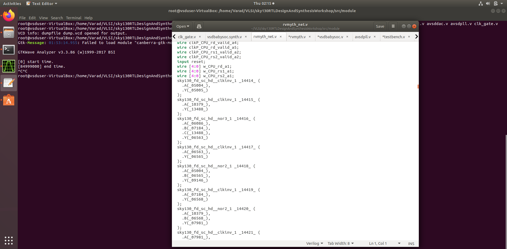

   


Now to observe the output waveform of synthesised RISC-V

```bash
iverilog ../../my_lib/verilog_model/primitives.v ../../my_lib/verilog_model/sky130_fd_sc_hd.v rvmyth.v testbench.v vsdbabysoc.v avsddac.v avsdpll.v clk_gate.v
./a.out
gtkwave dump.vcd
```
   

   

   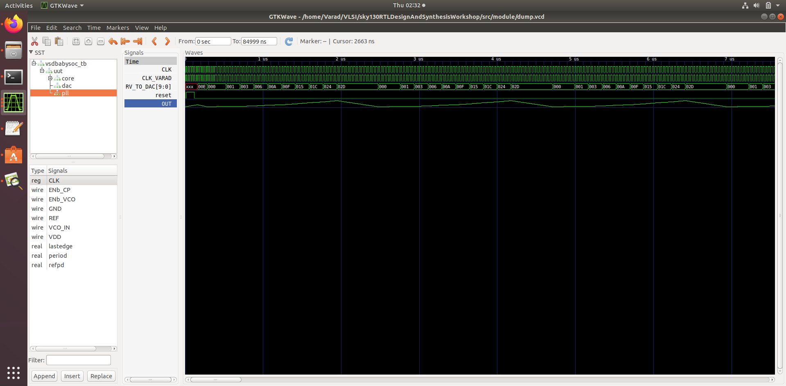

Observations from Babysoc RTL simulation:

   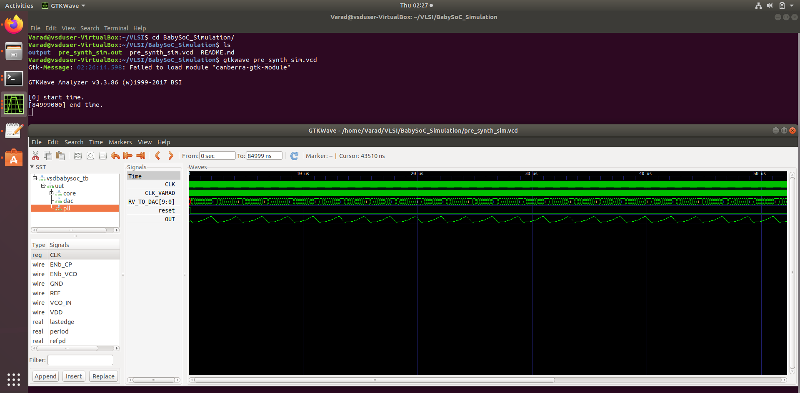
   
   
   


</details>


 # Task-11 Timing Analysis of VSDBabySOC using OpenSTA
<details>

The following commands were run to get the max-min report of the VSDbabysoc design:
``` bash
read_liberty -min ./lib/sky130_fd_sc_hd__tt_025C_1v80.lib
read_liberty -min ./lib/avsdpll.lib
read_liberty -min ./lib/avsddac.lib
read_liberty -max ./lib/sky130_fd_sc_hd__tt_025C_1v80.lib
read_liberty -max ./lib/avsdpll.lib
read_liberty -max ./lib/avsddac.lib
read_verilog ../output/synth/vsdbabysoc.synth.v
link_design vsdbabysoc
read_sdc ./sdc/vsdbabysoc_synthesis.sdc
report_checks -path_delay min_max -format full_clock_expanded -digits 4
```

   

   

   

Here is the hold report:

   
   
Here is the setup report:

   

The below is the sdc file (to set the constraints on the design):

```bash
set PERIOD 10.85

set_units -time ns
create_clock [get_pins {pll/CLK}] -name clk -period $PERIOD
set_clock_uncertainty -setup  [expr $PERIOD * 0.05] [get_clocks clk]
set_input_delay -min 0 [get_ports ENb_CP] -clock [get_clocks "clk"]
set_input_delay -min 0 [get_ports ENb_VCO] -clock [get_clocks "clk"]
set_input_delay -min 0 [get_ports REF] -clock [get_clocks "clk"]
set_input_delay -min 0 [get_ports VCO_IN] -clock [get_clocks "clk"]
set_input_delay -min 0 [get_ports VREFH] -clock [get_clocks "clk"]
set_clock_transition [expr $PERIOD * 0.05] [get_clocks clk]
set_clock_uncertainty -hold [expr $PERIOD * 0.08] [get_clocks clk]
set_input_transition [expr $PERIOD * 0.08] [get_ports ENb_CP]
set_input_transition [expr $PERIOD * 0.08] [get_ports ENb_VCO]
set_input_transition [expr $PERIOD * 0.08] [get_ports REF]
set_input_transition [expr $PERIOD * 0.08] [get_ports VCO_IN]
set_input_transition [expr $PERIOD * 0.08] [get_ports VREFH]
```

</details>

# Task-12 Post Synthesis Static Timing Analysis using OpenSTA for all the sky130 lib files
<details>
Snapshot of constraints file:
	


Store all the `lib` files in a folder named `timing_libs`. Go to `VSDBabySoC/src` and create a file `sta_across_pvt.tcl`. The below consists of the contents of the tickle file:


Screenshot of the command to be executed in terminal after opening sta:


Min values (Worst hold Slack):


Man values (Worst Negative Slack):


Table summarising all values for different lib files:


 
</details>

# Task-13 Advanced Physical Design using OpenLane using Sky130
<details>

## Day-1

 <details>
	
# **Understanding ASIC Design and Flow**

This document provides an overview of various components involved in the design and implementation of an ASIC (Application-Specific Integrated Circuit), from the chip design process to hardware execution. 

---

## **Key Components of ASIC Design**

### 1. **QFN-48 Package**
   A **Quad Flat No-leads (QFN) 48** package is a leadless IC package with 48 connection pads around the perimeter. It offers excellent thermal and electrical performance in a compact form, making it ideal for high-density applications.

   

### 2. **Chip**
   An **Integrated Circuit (IC)** is a silicon-based device that contains various functional blocks, such as memory, processing units, and I/O, designed for specific applications in electronics.

   

### 3. **Pads**
   **Pads** are small metallic areas on a chip or package used to connect the internal circuitry to external connections, enabling signal transfer to and from the IC.

### 4. **Core**
   The **core** is the central part of a chip containing the main processing unit and functional logic, optimized for power and performance.

### 5. **Die**
   The **die** is the section of a silicon wafer that contains an individual IC before it is packaged, housing all active circuits and elements necessary for the chip’s functions.

   

### 6. **IPs (Intellectual Properties)**
   **IPs** are pre-designed functional blocks or modules within a chip, such as USB controllers or memory interfaces. These IPs are licensed for reuse across various designs, saving time and cost in development.

---

## **From Software Applications to Hardware Flow**

To run an application on hardware, several steps take place, starting from high-level programming to the final execution on hardware.

### **Software Preparation for Hardware Execution:**

1. **System Software:**
   - The **Operating System (OS)** breaks down application functions written in high-level languages (e.g., C, C++, Java).
   
2. **Compiler:**
   - The **compiler** converts these high-level functions into architecture-specific low-level instructions.

3. **Assembler:**
   - The **assembler** translates the low-level instructions into binary machine code, understandable by the hardware.

### **Example: Stopwatch Application**
For a **stopwatch app** running on a RISC-V core:
- The OS generates a small function in C.
- The compiler outputs RISC-V-specific instructions.
- The assembler converts these into binary code for execution on the chip.

This process involves converting the high-level application into machine-readable binary code, allowing hardware (e.g., a chip) to execute the required functionality.

---

## **Components of ASIC Design**

### 1. **RTL Design**
   - **RTL (Register Transfer Level)** design describes the functional behavior of the circuit using HDLs (e.g., Verilog, VHDL), defining its logic and data paths.

### 2. **RTL Synthesis**
   - Converts RTL code into a gate-level netlist, which is a collection of standard cells like AND gates, flip-flops, and multiplexers.
   - Optimized for area, power, and timing.

### 3. **Floor and Power Planning**
   - Partitions the chip area, places major components, and defines the power grid and I/O placement to optimize area, power distribution, and signal flow.

### 4. **Placement**
   - Assigns physical locations to cells in a way that minimizes wire length, reduces signal delay, and meets design constraints.

### 5. **Clock Tree Synthesis (CTS)**
   - Optimizes the clock distribution network, ensuring even distribution to all flip-flops and registers to reduce clock skew.

### 6. **Routing**
   - Connects components based on placement, optimizing wire paths to maintain signal integrity, minimize congestion, and meet design rules.

### 7. **Sign-off**
   - The final verification stage, ensuring the design meets functionality, performance, power, and reliability targets.
   - This includes timing analysis, power analysis, and physical verification.

### 8. **GDSII File Generation**
   - Generates the **GDSII** file containing the complete layout needed for chip fabrication. This file is used by manufacturers to create the photomasks required for chip production.

---

## **Simplified RTL to GDS Flow**

1. **RTL Design:**
   - Describes the circuit’s functionality using HDLs like Verilog or VHDL.

2. **RTL Synthesis:**
   - Converts RTL into a gate-level netlist by mapping it to standard cells and optimizing for area, power, and timing.

3. **Floor and Power Planning:**
   - Plans the chip area, optimizes power grid and I/O placements.

4. **Placement:**
   - Assigns physical locations to the cells to minimize wire length and reduce signal delays.

5. **Clock Tree Synthesis (CTS):**
   - Optimizes the clock network to balance signal distribution and reduce skew.

6. **Routing:**
   - Ensures optimal wire paths between cells, meeting design rules.

7. **Sign-off:**
   - Verifies that all design constraints, including power, performance, and area, are met.

8. **GDSII File Generation:**
   - Final layout files are generated for fabrication.

---

## **OpenLane ASIC Flow**


The **OpenLane ASIC Flow** consists of a set of tools and steps to carry out the design and verification of an ASIC.

### **Key Tools and Steps:**

- **RTL Synthesis, Technology Mapping, and Formal Verification:**
  - Tools: Yosys (for RTL synthesis), ABC (for technology mapping and formal verification).

- **Static Timing Analysis:**
  - Tools: OpenSTA (for static timing analysis).

- **Floor Planning:**
  - Tools: init_fp (initial floorplanning), ioPlacer (I/O placement), pdn (power distribution planning), tapcell (tap cell insertion).

- **Placement:**
  - Tools: RePLace (global placement), Resizer (optional resizing), OpenPhySyn (placement), OpenDP (detailed placement).

- **Clock Tree Synthesis:**
  - Tools: TritonCTS (for clock tree synthesis).

- **Fill Insertion:**
  - Tools: OpenDP (for filler placement).

- **Routing:**
  - Tools: FastRoute (for global routing), TritonRoute (for detailed routing).

- **SPEF Extraction:**
  - Tools: OpenRCX (or SPEF-Extractor for parasitic extraction).

- **GDSII Streaming Out:**
  - Tools: Magic and KLayout (for viewing and editing GDSII files).

- **Design Rule Checking (DRC):**
  - Tools: Magic and KLayout (for DRC checks).

- **Layout vs. Schematic (LVS) Check:**
  - Tools: Netgen (for LVS checks).

- **Antenna Checks:**
  - Tools: Magic (for antenna checks).

---

### Synthesis in Openlane:

Now, follow the commnads below to run synthesis using OpenLane.

```bash
cd Desktop/work/tools/openlane_working_dir/openlane
docker
./flow.tcl -interactive
package require openlane 0.9
prep -design picorv32a
run_synthesis
```
   


To view the netlist:

```bash
cd designs/picorv32a/runs/09-11_06-33/results/synthesis/
gedit picorv32a.synthesis.v
```

   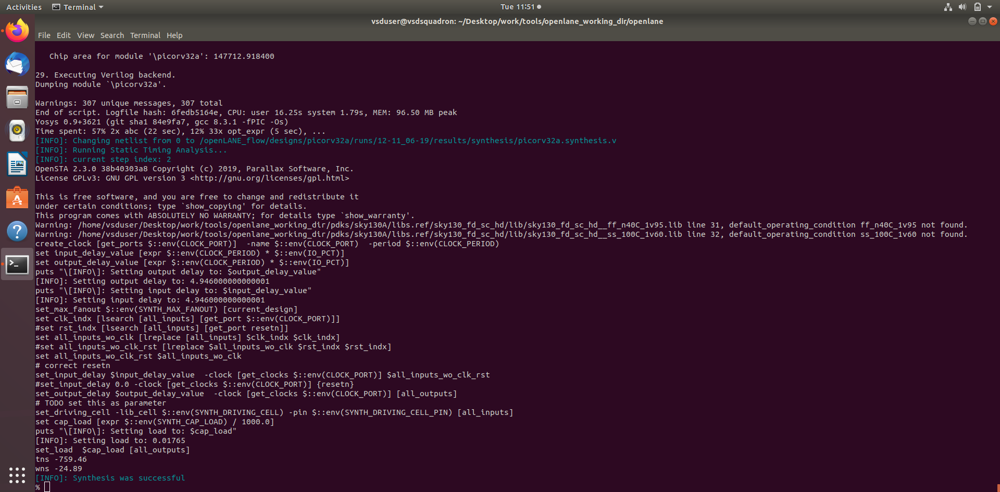


To view the yosys report:
```bash
cd ../..
cd reports/synthesis
gedit 1-yosys_4.stat.rpt
```

   

Report:

```bash

28. Printing statistics.

=== picorv32a ===

   Number of wires:              14596
   Number of wire bits:          14978
   Number of public wires:        1565
   Number of public wire bits:    1947
   Number of memories:               0
   Number of memory bits:            0
   Number of processes:              0
   Number of cells:              14876
     sky130_fd_sc_hd__a2111o_2       1
     sky130_fd_sc_hd__a211o_2       35
     sky130_fd_sc_hd__a211oi_2      60
     sky130_fd_sc_hd__a21bo_2      149
     sky130_fd_sc_hd__a21boi_2       8
     sky130_fd_sc_hd__a21o_2        57
     sky130_fd_sc_hd__a21oi_2      244
     sky130_fd_sc_hd__a221o_2       86
     sky130_fd_sc_hd__a22o_2      1013
     sky130_fd_sc_hd__a2bb2o_2    1748
     sky130_fd_sc_hd__a2bb2oi_2     81
     sky130_fd_sc_hd__a311o_2        2
     sky130_fd_sc_hd__a31o_2        49
     sky130_fd_sc_hd__a31oi_2        7
     sky130_fd_sc_hd__a32o_2        46
     sky130_fd_sc_hd__a41o_2         1
     sky130_fd_sc_hd__and2_2       157
     sky130_fd_sc_hd__and3_2        58
     sky130_fd_sc_hd__and4_2       345
     sky130_fd_sc_hd__and4b_2        1
     sky130_fd_sc_hd__buf_1       1656
     sky130_fd_sc_hd__buf_2          8
     sky130_fd_sc_hd__conb_1        42
     sky130_fd_sc_hd__dfxtp_2     1613
     sky130_fd_sc_hd__inv_2       1615
     sky130_fd_sc_hd__mux2_1      1224
     sky130_fd_sc_hd__mux2_2         2
     sky130_fd_sc_hd__mux4_1       221
     sky130_fd_sc_hd__nand2_2       78
     sky130_fd_sc_hd__nor2_2       524
     sky130_fd_sc_hd__nor2b_2        1
     sky130_fd_sc_hd__nor3_2        42
     sky130_fd_sc_hd__nor4_2         1
     sky130_fd_sc_hd__o2111a_2       2
     sky130_fd_sc_hd__o211a_2       69
     sky130_fd_sc_hd__o211ai_2       6
     sky130_fd_sc_hd__o21a_2        54
     sky130_fd_sc_hd__o21ai_2      141
     sky130_fd_sc_hd__o21ba_2      209
     sky130_fd_sc_hd__o21bai_2       1
     sky130_fd_sc_hd__o221a_2      204
     sky130_fd_sc_hd__o221ai_2       7
     sky130_fd_sc_hd__o22a_2      1312
     sky130_fd_sc_hd__o22ai_2       59
     sky130_fd_sc_hd__o2bb2a_2     119
     sky130_fd_sc_hd__o2bb2ai_2     92
     sky130_fd_sc_hd__o311a_2        8
     sky130_fd_sc_hd__o31a_2        19
     sky130_fd_sc_hd__o31ai_2        1
     sky130_fd_sc_hd__o32a_2       109
     sky130_fd_sc_hd__o41a_2         2
     sky130_fd_sc_hd__or2_2       1088
     sky130_fd_sc_hd__or2b_2        25
     sky130_fd_sc_hd__or3_2         68
     sky130_fd_sc_hd__or3b_2         5
     sky130_fd_sc_hd__or4_2         93
     sky130_fd_sc_hd__or4b_2         6
     sky130_fd_sc_hd__or4bb_2        2

   Chip area for module '\picorv32a': 147712.918400
```

```bash
Flop ratio = Number of D Flip flops = 1613  = 0.1084
             ______________________   _____
             Total Number of cells    14876

 Percentage  of  DFF′s = 0.108429685 ∗ 100 = 10.84296854   % 

```

   

 </details>


# Day-2
<details>

**Utilization Factor and Aspect Ratio** : In IC floor planning, utilization factor and aspect ratio are key parameters. The utilization factor is the ratio of the area occupied by the netlist to the total core area. While a perfect utilization of 1 (100%) is ideal, practical designs target a factor of 0.5 to 0.6 to allow space for buffer zones, routing channels, and future adjustments. The aspect ratio, defined as height divided by width, indicates the chip’s shape; an aspect ratio of 1 denotes a square, while other values result in a rectangular layout. The aspect ratio is chosen based on functional, packaging, and manufacturing needs.

```bash
Utilisation Factor =  Area occupied by netlist
                     __________________________
                         Total area of core
                         

Aspect Ratio =  Height
               ________
                Width
```

**Pre-placed cells** : Pre-placed cells are essential functional blocks, such as memory, custom processors, and analog circuits, positioned manually in fixed locations. These blocks are crucial for the chip’s performance and remain fixed during placement and routing to preserve their functionality and layout integrity.

**Decoupling Capacitors** : Decoupling capacitors are placed near logic circuits to stabilize power supply voltages during transient events. Acting as local energy reserves, they help reduce voltage fluctuations, crosstalk, and electromagnetic interference (EMI), ensuring reliable power delivery to sensitive circuits.

**Power Planning**: A robust power planning strategy includes creating a power and ground mesh to distribute VDD and VSS evenly across the chip. This setup ensures stable power delivery, minimizes voltage drops, and improves overall efficiency. Multiple power and ground points reduce the risk of instability and voltage drop issues, supporting the design’s power needs effectively.

**Pin Placement**: Pin placement (I/O planning) is crucial for functionality and reliability. Strategic pin assignment minimizes signal degradation, preserves data integrity, and helps manage heat dissipation. Proper positioning of power and ground pins supports thermal management and enhances signal strength, contributing to overall system stability and manufacturability.

**Floorplaning using OpenLANE:**

Run the following commands:
```bash
cd Desktop/work/tools/openlane_working_dir/openlane
docker
```

Snapshots of image showing synthesis was successful and floorplan was being run now.

   


```bash
./flow.tcl -interactive
package require openlane 0.9
prep -design picorv32a
run_synthesis
run_floorplan
```
   


Now, run the below commands in a new terminal:

```bash
cd Desktop/work/tools/openlane_working_dir/openlane/designs/picorv32a/runs12-11_16-11/results/floorplan
gedit picorv32a.floorplan.def
```
   


According to floorplan definition:

```bash
1000 Unit Distance = 1 Micron
Die width in unit distance = 660685−0 = 660685
Die height in unit distance = 671405−0 = 671405
Distance in microns = Value in Unit Distance/1000
​Die width in microns = 660685/1000 = 660.685 Microns
Die height in microns = 671405/1000 = 671.405 Microns
Area of die in microns = 660.685 × 671.405 = 443587.212425 Square Microns
To view the floorplan in magic. Open a new terminal and run the below commands:
```

Now we can view the floorpan using magic. This can be done in new terminal:

```bash
cd Desktop/work/tools/openlane_working_dir/openlane/designs/picorv32a/runs/12-11_16-11/results/floorplan/
magic -T /home/vsduser/Desktop/work/tools/openlane_working_dir/pdks/sky130A/libs.tech/magic/sky130A.tech lef read ../../tmp/merged.lef def read picorv32a.floorplan.def &
```
   


Command to run placement:

```bash
run_placement
```
   


```bash
cd Desktop/work/tools/openlane_working_dir/openlane/designs/picorv32a/runs/12-11_16-11/results/placement/
magic -T /home/vsduser/Desktop/work/tools/openlane_working_dir/pdks/sky130A/libs.tech/magic/sky130A.tech lef read ../../tmp/merged.lef def read picorv32a.placement.def &
```

   


# **Cell Design and Characterization Flow**

## **Introduction to Library and Cell Design**

A **library** is a collection of standard cells used in digital designs, each with different sizes, functionalities, and threshold voltages. These cells serve as building blocks in an integrated circuit (IC). The cell design flow follows a sequence of steps to create, characterize, and validate cells for use in ASIC or FPGA designs.

### **Inputs for Cell Design Flow:**

- **PDKs (Process Design Kits):** Contains essential design data such as:
  - DRC (Design Rule Check) & LVS (Layout Versus Schematic) files
  - SPICE models for analog simulations
  - Libraries containing predefined cells and user-defined specifications
- **Design Steps:**
  1. **Circuit Design:** The initial design of the circuit based on functionality.
  2. **Layout Design:** The art of arranging the components on the silicon wafer. It involves:
     - **Euler’s Path** (to ensure no shorts or open circuits)
     - **Stick Diagram** (a graphical representation of the layout)
  3. **Extraction of Parasitics:** Identifying the parasitic components like resistance and capacitance that can affect the circuit's performance.
  4. **Characterization:** Involves measuring timing, noise, and power consumption characteristics of the cell.

### **Outputs:**
- **CDL** (Circuit Description Language) files for circuit representation
- **LEF** (Library Exchange Format) for physical layout
- **GDSII** for chip layout and fabrication
- **Extracted SPICE netlist** (.cir) files
- **Characterization Results:** Timing, noise, and power data in `.lib` files

---

## **Standard Cell Characterization Flow**

A typical standard cell characterization flow involves several steps that are essential to characterize the behavior and performance of cells in a digital design. The general flow includes the following stages:

1. **Read in the Models and Technology Files:** These files contain process technology data required for cell characterization.
2. **Read Extracted SPICE Netlist:** The netlist describes the electrical connectivity of the cell.
3. **Recognize Behavior of the Cells:** The behavior of each cell is analyzed based on its functionality.
4. **Read the Subcircuits:** Extract the subcircuits from the netlist.
5. **Attach Power Sources:** Supply necessary power to the cells during characterization.
6. **Apply Stimulus to the Characterization Setup:** A voltage or current stimulus is applied to simulate the circuit.
7. **Provide Necessary Output Capacitance Loads:** Set up load conditions for the output of the cell to simulate real-world conditions.
8. **Provide Necessary Simulation Commands:** These define the simulation conditions, such as transient analysis and timing measurements.

Once all these steps are defined, the configuration file is fed into a **characterization software** called **GUNA**, which generates the **timing**, **power**, and **noise** models. The results are saved as `.lib` files and classified into:
- **Timing Characterization**
- **Power Characterization**
- **Noise Characterization**

---

## **Timing Parameters**

In digital designs, several timing parameters are defined to assess the performance of standard cells. The following parameters are commonly used:

| **Timing Parameter**         | **Value**          |
|------------------------------|--------------------|
| `slew_low_rise_thr`           | 20% value          |
| `slew_high_rise_thr`          | 80% value          |
| `slew_low_fall_thr`          | 20% value          |
| `slew_high_fall_thr`         | 80% value          |
| `in_rise_thr`                | 50% value          |
| `in_fall_thr`                | 50% value          |
| `out_rise_thr`               | 50% value          |
| `out_fall_thr`               | 50% value          |

### **Propagation Delay**

**Propagation delay** refers to the time it takes for a change in an input signal to propagate through a circuit and cause a corresponding change in the output signal. The time is measured when the input and output signals reach 50% of their final values.

- **Rise Delay:** 
```bash
rise_delay = time(out_fall_thr) - time(in_rise_thr)
```


### **Transition Time**

Transition time is the time it takes for a signal to transition between states. It is usually measured from 10% to 90% or 20% to 80% of the signal's voltage levels.

- **Fall Transition Time:**
```bash
fall_transition_time = time(slew_high_fall_thr) - time(slew_low_fall_thr)
```


- **Rise Transition Time:**
```bash
rise_transition_time = time(slew_high_rise_thr) - time(slew_low_rise_thr)
```

---

## **Conclusion**

This flow and the techniques described are part of the process used to design, simulate, and validate the behavior of standard cells in digital circuit design. By properly characterizing these cells, engineers can ensure that the cells perform optimally in terms of timing, noise, and power in real-world applications.

The **GUNA software** plays a key role in generating the required .lib files that are used for further optimization and integration into larger ASIC or FPGA designs.


</details>


# Day-3
<details>
### CMOS inverter ngspice simulations
Creating a SPICE Deck for a CMOS Inverter Simulation

1. Netlist Creation:

    Define component connections (netlist) for the CMOS inverter.
    Label nodes for input, output, ground, and supply.

2. Device Sizing:

    Specify Width-to-Length (W/L) ratios for PMOS and NMOS transistors.
    Ensure PMOS width is 2x to 3x larger than NMOS width.

3. Voltage Levels:

    Set gate and supply voltages.

4. Node Naming:

    Assign node names (e.g., VDD, GND, IN, OUT) for clarity in the SPICE netlist.
   
 

 ```bash
***syntax for PMOS and NMOS desription***
[component name] [drain] [gate] [source] [substrate] [transistor type] W=[width] L=[length]

 ***simulation commands***
.op --- is the start of SPICE simulation operation where Vin sweeps from 0 to 2.5 with 0.5 steps
tsmc_025um_model.mod  ----  model file which contains the technological parameters for the 0.25um NMOS and PMOS
```

Commands to simulate in SPICE:

```bash
source [filename].cir
run
setplot 
dc1 
plot out vs in
```


Switching Threshold VmVm​ of a CMOS Inverter

Definition:

    The switching threshold VmVm​ is the critical voltage at which a CMOS inverter switches between outputting a "0" and a "1".
    At VmVm​, both PMOS and NMOS transistors are in saturation, resulting in high leakage current.

Effects of Transistor Sizing:

    If PMOS is thicker (wider) than NMOS, VmVm​ is higher (e.g., 1.2V vs. 1V).
    If NMOS is thicker than PMOS, VmVm​ is lower.

Leakage Current:

    At VmVm​, both transistors are turned on, causing current to flow directly from VDD to Ground, known as leakage current.

Simulation to Find VmVm​:
```bash
Vin in 0 2.5
*** Simulation Command ***
.op
.dc Vin 0 2.5 0.05
```


Transient analysis is used for finding propagation delay. SPICE transient analysis uses pulse input shown below:


The simulation commands:
```bash
Vin in 0 0 pulse 0 2.5 0 10p 10p 1n 2n 
*** Simulation Command ***
.op
.tran 10p 4n
```
Result of SPICE simulation for transient analysis:


Now, we clone the custom inverter:

```bash
cd Desktop/work/tools/openlane_working_dir/openlane
git clone https://github.com/nickson-jose/vsdstdcelldesign
cd vsdstdcelldesign
cp /home/vsduser/Desktop/work/tools/openlane_working_dir/pdks/sky130A/libs.tech/magic/sky130A.tech .
ls
magic -T sky130A.tech sky130_inv.mag &
```
   

   


### Inception of Layout CMOS Fabrication Process

1. Substrate Preparation:

    Start with a silicon wafer substrate.

2. N-Well Formation:

    Create N-well regions using phosphorus ion implantation or diffusion.

3. P-Well Formation:

    Form P-well regions using boron ion implantation or diffusion.

4. Gate Oxide Deposition:

    Deposit a thin silicon dioxide layer as the gate oxide.

5. Poly-Silicon Deposition:

    Deposit polysilicon on the gate oxide for the gate electrode.

6. Poly-Silicon Masking and Etching:

    Use a photoresist mask to define polysilicon areas and etch the rest.

7. N-Well Masking and Implantation:

    Mask N-well areas and implant phosphorus impurities.

8. P-Well Masking and Implantation:

    Mask P-well areas and implant boron impurities.

9. Source/Drain Implantation:

    Implant dopants to create source and drain regions.

10. Gate Formation: - Define the gate electrode by etching the polysilicon layer.

11. Source/Drain Masking and Etching: - Mask source/drain regions and etch the oxide layer.

12. Contact/Via Formation: - Etch contact holes/vias to expose underlying regions.

13. Metal Deposition: - Deposit a metal layer (aluminum or copper) for interconnects.

14. Metal Masking and Etching: - Mask and etch to define metal interconnect patterns.

15. Passivation Layer Deposition: - Deposit a protective silicon dioxide or nitride layer.

16. Final Testing and Packaging: - Test the wafer, separate working chips, and package them.


Inverter layout:

   

Identify NMOS:

   


Spice extraction of inverter in Magic. Run these in the tkcon window:
```bash
# Check current directory
pwd
extract all
ext2spice cthresh 0 rthresh 0
ext2spice
```
   
   


To view the spice file:

   


Now modify the `sky130_inv.spice` file to find the transient response:

```bash
* SPICE3 file created from sky130_inv.ext - technology: sky130A

.option scale=0.01u
.include ./libs/pshort.lib
.include ./libs/nshort.lib

//.subckt sky130_inv A Y VPWR VGND
M1000 Y A VGND VGND nshort_model.0 w=35 l=23
+  ad=1.44n pd=0.152m as=1.37n ps=0.148m
M1001 Y A VPWR VPWR pshort_model.0 w=37 l=23
+  ad=1.44n pd=0.152m as=1.52n ps=0.156m

VDD VPWR 0 3.3V
VSS VGND 0 0V
Va A VGND PULSE(0V 3.3V 0 0.1ns 0.1ns 2ns 4ns)

C0 A VPWR 0.0774f
C1 VPWR Y 0.117f
C2 A Y 0.0754f
C3 Y VGND 2f
C4 A VGND 0.45f
C5 VPWR VGND 0.781f
//.ends

.tran 1n 20n
.control
run
.endc
.end
```

Now, simulate the spice netlist:

```bash
ngspice sky130_inv.spice
```
   

```bash
plot y vs time a
```
   


Using this transient response, we will now characterize the cell's slew rate and propagation delay:

Rise Transition: Time taken for the output to rise from 20% to 80% of max value Fall Transition: Time taken for the output to fall from 80% to 20% of max value Cell Rise delay: difference in time(50% output rise) to time(50% input fall) Cell Fall delay: difference in time(50% output fall) to time(50% input rise)

```bash
Rise Transition : 2.24638 - 2.18242 =  0.06396 ns = 63.96 ps
Fall Transition : 4.0955 - 4.05536 =  0.0419 ns = 41.9 ps
Cell Rise Delay : 2.21144 - 2.15008 = 0.06136 ns = 61.36 ps
Cell Fall Delay : 4.07807 - 4.05 =0.02 ns = 20 ps
```
Magic Tool options and DRC Rules:

Now, go to home directory and run the below commands:
```bash
cd
wget http://opencircuitdesign.com/open_pdks/archive/drc_tests.tgz
tar xfz drc_tests.tgz
cd drc_tests
ls -al
gvim .magicrc
magic -d XR &
```
   

   


First load the poly file by load poly.mag on tkcon window.

   


We can see that Poly.9 is incorrect.

Add the below commands in the sky130A.tech

   

   


```bash
tech load sky130A.tech
drc check
drc why
```
   

   

</details>

# Day-4:
<details>
	
	
 ###  Pre-layout timing analysis and importance of good clock tree:

 Commands to extract tracks.info file:

 ```bash
cd Desktop/work/tools/openlane_working_dir/openlane/vsdstdcelldesign
cd ../../pdks/sky130A/libs.tech/openlane/sky130_fd_sc_hd/
less tracks.info
```
   

Commands for tkcon window to set grid as tracks of locali layer

```bash
grid 0.46um 0.34um 0.23um 0.17um
```
   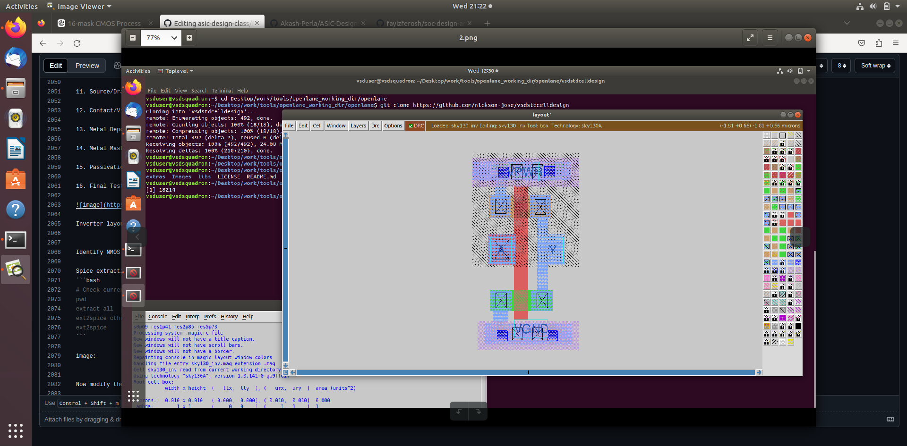

With grid:
   
   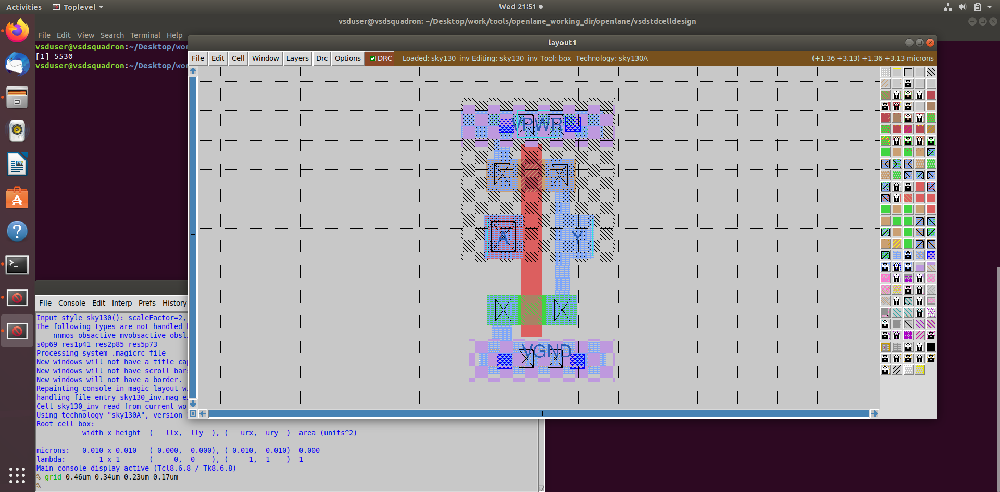

Now, save it by giving a custom name:
```bash
save sky130_varinv.mag
```
   

Now, open it by using the following commands:
```bash
magic -T sky130A.tech sky130_varinv.mag &
```
   

Now, type the following command in tkcon window:
```bash
lef write
```
   

   

Modify config.tcl:
```bash
# Design
set ::env(DESIGN_NAME) "picorv32a"

set ::env(VERILOG_FILES) "./designs/picorv32a/src/picorv32a.v"
set ::env(SDC_FILES) "./designs/picorv32a/src/picorv32a.sdc"


set ::env(CLOCK_PERIOD) "5.000"
set ::env(CLOCK_PORT) "clk"

set ::env(CLOCK_NET) $::env(CLOCK_PORT) 


set ::env(LIB_SYNTH) "$::env(OPENLANE_ROOT)/designs/picorv32a/src/sky130_fd_sc_hd__typical.lib "
set ::env(LIB_FASTEST) "$::env(OPENLANE_ROOT)/designs/picorv32a/src/sky130_fd_sc_hd__fast.lib"
set ::env(LIB_SLOWEST) "$::env(OPENLANE_ROOT)/designs/picorv32a/src/sky130_fd_sc_hd__slow.lib "
set ::env(LIB_TYPICAL) "$::env(OPENLANE_ROOT)/designs/picorv32a/src/sky130_fd_sc_hd__typical.lib"

set ::env(EXTRA_LEFS) [glob $::env(OPENLANE_ROOT)/designs/$::env(DESIGN_NAME)/src/*.lef]   ## this is the new line added to the existing config.tcl file

set filename $::env(OPENLANE_ROOT)/designs/$::env(DESIGN_NAME)/$::env(PDK)_$::env(STD_CELL_LIBRARY)_config.tcl
if { [file exists $filename] == 1 } {
  source $filename
}
```
Now, run openlane flow synthesis:
```bash
cd Desktop/work/tools/openlane_working_dir/openlane
docker
```
   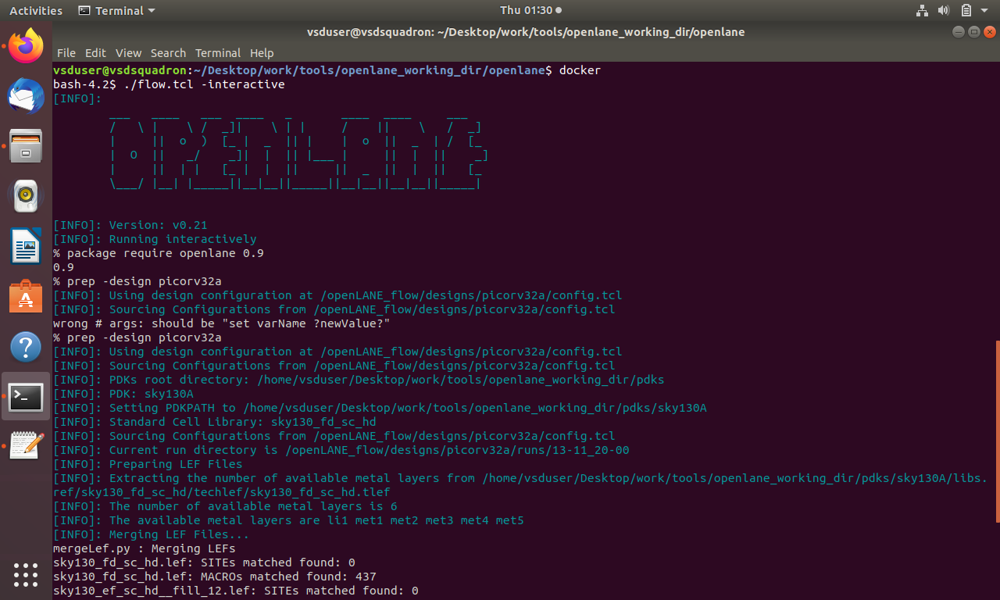

```bash
./flow.tcl -interactive
package require openlane 0.9
prep -design picorv32a
set lefs [glob $::env(DESIGN_DIR)/src/*.lef]
add_lefs -src $lefs
run_synthesis
```
   
   
   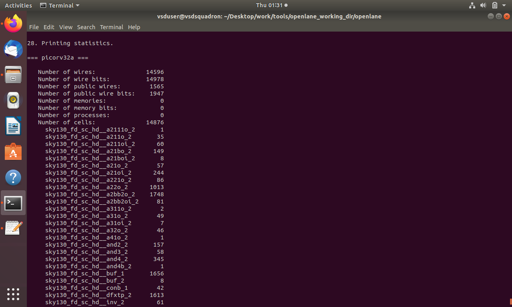
   
   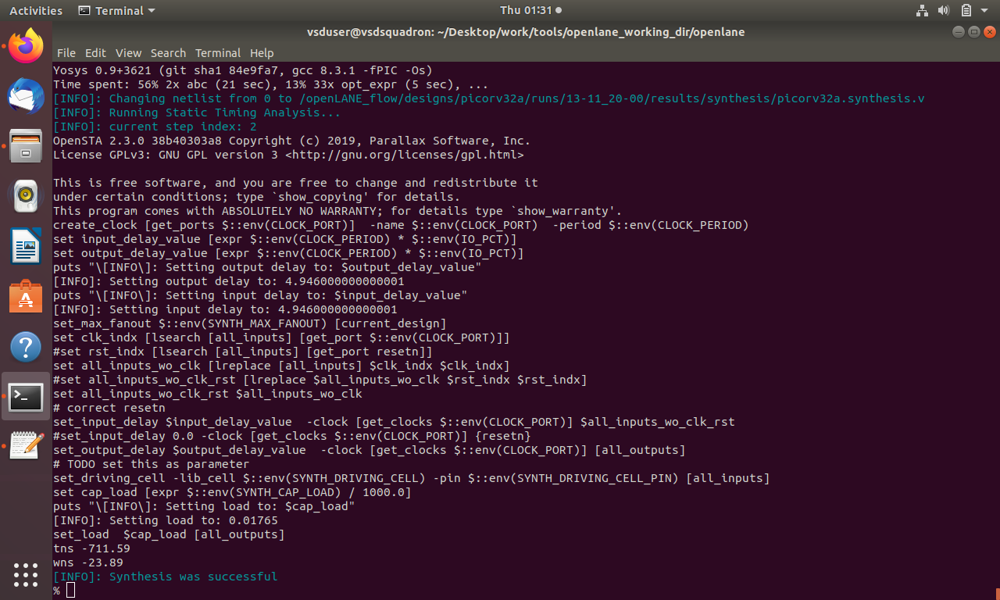


</details>
</details>
